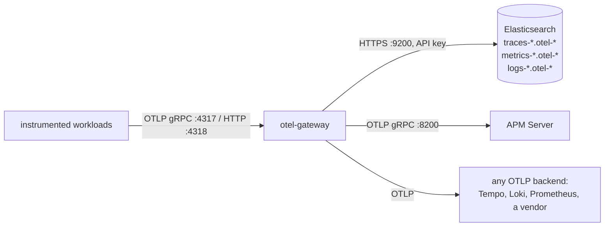
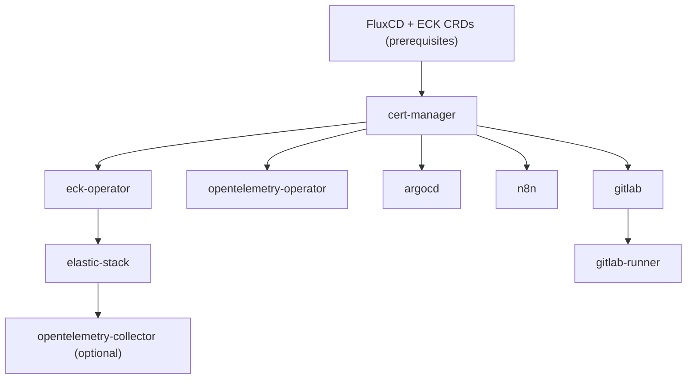

# OpsContinuum Chart

**This repository is public.** Your real domain, your real ACME contact
email, your real registry credentials and the passwords for the bundled
GitLab PostgreSQL and Redis instances go in a gitignored local overlay only
(`values.local.yaml`, or `overlays/<env>/values.local.yaml`) and are never
committed here, to this repository or to any fork of it. Start from
`values.local.yaml.example`. "Setting real values locally" below gives the
exact mechanism, and the pre-commit guardrail described there is worth
enabling.

A Kubernetes platform deployment using GitOps (FluxCD). It includes:

- cert-manager, for TLS certificate management
- ECK Operator 3.x, Elastic Cloud on Kubernetes (supports Elastic 9.x)
- Elastic Stack 9.x: Elasticsearch, Kibana, Fleet Server, Elastic Agent, APM Server
- OpenTelemetry Operator, for auto-instrumentation and distributed tracing
- OpenTelemetry Collector gateway (optional), one OTLP endpoint that forwards
  traces, metrics and logs to Elasticsearch, APM Server or any OTLP backend
- GitLab CE
- GitLab Runner
- Argo CD
- n8n workflow automation

---

## What this is

This repository is the Flux layer: a single Helm chart, deployed by FluxCD,
that bootstraps the underlying platform capability of a Kubernetes cluster. It
is not an application repository, and it does not describe the workloads that
eventually run on the cluster.

### The boundary: Flux owns capability, Argo owns instances

This chart deploys Argo CD as one of its packages. That boundary is deliberate:

- Flux (this repository) owns capability. It reconciles the platform itself:
  ingress, certificates, logging, CI/CD infrastructure, and Argo CD as a piece
  of platform tooling. Changes here answer the question "what can this cluster
  do?"
- Argo CD owns instances. Once Argo CD is running, it manages the application
  workloads deployed on top of the platform, through its own Application and
  ApplicationSet sources. Changes there answer the question "what is running
  right now?"

Do not add application-specific manifests to this repository. Application
state belongs in Argo CD-managed sources, once the platform capability this
chart provides exists.

---

## Before you deploy

The chart ships with no defaults for the values below. Rendering fails with a
clear error until each one is set, rather than silently deploying against
somebody else's domain, email address, or a default password shipped in a
public chart. Set these first:

| Value | Purpose |
|-------|---------|
| `domain` | Base domain for all ingress hosts |
| `certManager.acmeEmail` | Contact email for Let's Encrypt account registration and the Cloudflare DNS-01 solver |
| `gitlab.postgresqlPassword` | Password for the bundled GitLab PostgreSQL StatefulSet |
| `gitlab.postgresqlPostgresPassword` | Password for the bundled PostgreSQL superuser |
| `gitlab.redisPassword` | Password for the bundled GitLab Redis StatefulSet |

Generate strong passwords with, for example:

```bash
openssl rand -base64 24
```

"Setting real values locally" below says where these go. They do not belong in
this public tree.

---

## Environment overlays

The chart uses Kustomize overlays for multi-environment support. Choose the
overlay that matches your deployment target:

| Environment | Overlay path | Description |
|-------------|--------------|-------------|
| Rancher Desktop | `overlays/rancher-desktop` | Local development with built-in Traefik |
| Harvester | `overlays/harvester` | Harvester HCI cluster with Traefik (secondary) + MetalLB |

### Harvester architecture note

Harvester runs its own nginx ingress controller on ports 80/443 for the
Harvester admin UI. Do not replace or disable nginx; doing so breaks the
Harvester admin interface.

The Harvester overlay deploys Traefik as a secondary ingress controller that
runs alongside nginx:

- nginx stays on the node's primary IP (ports 80/443) for Harvester admin
- Traefik gets a separate LoadBalancer IP from MetalLB for your applications

This dual-ingress setup keeps Harvester working while providing Traefik for
your workloads.

### Repository structure

```
base/                           # Base Kustomize resources (do not deploy directly)
├── chart/                      # Helm chart with templates
│   ├── values.yaml             # Default values (override in overlay)
│   └── templates/
├── helmrelease.yaml            # FluxCD HelmRelease resource
└── kustomization.yaml

overlays/
├── rancher-desktop/            # Local development overlay
│   ├── kustomization.yaml
│   └── helmrelease-patch.yaml  # Rancher Desktop specific settings
│
└── harvester/                  # Harvester overlay
    ├── kustomization.yaml
    └── helmrelease-patch.yaml  # Harvester specific settings (edit this!)
```

### Configuring your environment

1. Choose your overlay based on your target cluster.
2. Edit the overlay's `helmrelease-patch.yaml` to set your domain and other
   settings.

For Harvester (`overlays/harvester/helmrelease-patch.yaml`):

```yaml
# Replace yourdomain.local with your domain
domain: yourdomain.local

# Set your MetalLB IP range
metallb:
  addressPool:
    addresses:
      - "192.168.1.240-192.168.1.250"  # Your network's available IPs
```

For Rancher Desktop (`overlays/rancher-desktop/helmrelease-patch.yaml`):

```yaml
# Local development domain (uses hosts file)
domain: dev.yourdomain.local
```

### Hosts file setup

For local development, or when DNS is not configured, add entries to your
hosts file.

#### Windows

1. Open Notepad as Administrator (right-click, "Run as administrator").
2. File, Open, then navigate to `C:\Windows\System32\drivers\etc\hosts`.
3. Add the entries below and save.

#### Linux and macOS

```bash
sudo nano /etc/hosts
# Add entries below, then Ctrl+O to save, Ctrl+X to exit
```

#### Hosts entries

For Rancher Desktop (`dev.yourdomain.local`):

```
127.0.0.1 argocd.dev.yourdomain.local
127.0.0.1 gitlab.dev.yourdomain.local
127.0.0.1 registry.dev.yourdomain.local
127.0.0.1 minio.dev.yourdomain.local
127.0.0.1 kas.dev.yourdomain.local
127.0.0.1 n8n.dev.yourdomain.local
127.0.0.1 kibana.dev.yourdomain.local
```

For Harvester (using the MetalLB IP):

```
# Replace 192.168.1.240 with your MetalLB assigned IP (check with: kubectl get svc -n traefik)
192.168.1.240 argocd.yourdomain.local
192.168.1.240 gitlab.yourdomain.local
192.168.1.240 registry.yourdomain.local
192.168.1.240 minio.yourdomain.local
192.168.1.240 kas.yourdomain.local
192.168.1.240 n8n.yourdomain.local
192.168.1.240 kibana.yourdomain.local
```

---

## Quick start

### Prerequisites

- A Kubernetes cluster (v1.28+): Rancher Desktop, k3s, or compatible
- The Traefik ingress controller (included with k3s and Rancher Desktop; deployed via the overlay for Harvester)
- `kubectl` configured to access your cluster
- `helm` (v3.x)

### Create your own repository

Create your own copy of this chart. You configure your deployment in your
repository, and real values never belong in a public one.

Option A, fork on GitHub:

1. Click "Fork" on GitHub to create your own copy.
2. Clone your fork:
   ```bash
   git clone https://github.com/YOUR_USERNAME/YOUR_FORK.git
   cd YOUR_FORK
   ```

Option B, create a new repository:

```bash
# Clone this repository
git clone https://github.com/opscontinuum/flux-base.git
cd flux-base

# Remove the original remote and add your own
git remote remove origin
git remote add origin https://github.com/YOUR_USERNAME/YOUR_REPO.git

# Push to your repository
git push -u origin main
```

---

## Step 1: install FluxCD

```bash
kubectl apply -f https://github.com/fluxcd/flux2/releases/latest/download/install.yaml

# Wait for controllers to be ready
kubectl -n flux-system rollout status deployment/helm-controller
kubectl -n flux-system rollout status deployment/source-controller
```

## Step 2: install the ECK CRDs

The Elastic Stack requires the ECK Operator CRDs:

```bash
kubectl create -f https://download.elastic.co/downloads/eck/3.2.0/crds.yaml
```

## Step 3: create the required secrets

These secrets must exist before the chart deploys. Real credentials never
belong in git.

### Option A: Let's Encrypt with Cloudflare (production)

```bash
# Create cert-manager namespace
kubectl create namespace cert-manager

# Create Cloudflare API token secret
kubectl create secret generic cloudflare-api-token \
  --namespace cert-manager \
  --from-literal=api-token=YOUR_CLOUDFLARE_API_TOKEN
```

To create a Cloudflare API token:

1. Go to the [Cloudflare Dashboard](https://dash.cloudflare.com), My Profile, API Tokens.
2. Create a token with permissions `Zone:Zone:Read` and `Zone:DNS:Edit`.
3. Zone Resources: Include, Specific zone, your domain.

### Option B: Let's Encrypt with Route53 (production)

```bash
kubectl create namespace cert-manager

kubectl create secret generic route53-credentials \
  --namespace cert-manager \
  --from-literal=access-key-id=YOUR_ACCESS_KEY \
  --from-literal=secret-access-key=YOUR_SECRET_KEY
```

### Option C: self-signed certificates (development)

No secrets required. A self-signed CA is created automatically.

## Step 4: configure your deployment

Edit the appropriate overlay's `helmrelease-patch.yaml`:

- Rancher Desktop: `overlays/rancher-desktop/helmrelease-patch.yaml`
- Harvester: `overlays/harvester/helmrelease-patch.yaml`

```yaml
# Set your domain
domain: yourdomain.local

# Set your ACME contact email (required, no default)
certManager:
  acmeEmail: you@yourdomain.local

# Choose certificate issuer
# Options: "self-signed", "letsencrypt-staging", "letsencrypt-prod"
clusterIssuer: self-signed

# Set the bundled GitLab PostgreSQL/Redis passwords (required, no default)
gitlab:
  postgresqlPassword: "generate with: openssl rand -base64 24"
  postgresqlPostgresPassword: "generate with: openssl rand -base64 24"
  redisPassword: "generate with: openssl rand -base64 24"
```

### Enable or disable components

```yaml
certManager:
  enabled: true

eckOperator:
  enabled: true

elasticStack:
  enabled: true

gitlab:
  enabled: true

gitlabRunner:
  enabled: true

argocd:
  enabled: true

n8n:
  enabled: true

opentelemetryCollector:     # off by default; see "Where telemetry goes"
  enabled: false
```

Commit and push your configuration changes:

```bash
git add overlays/
git commit -m "Configure for my environment"
git push origin main
```

## Step 5: create the FluxCD resources

The GitRepository and Kustomization resources must be named `opsc` exactly.
The HelmRelease templates reference this name in their `sourceRef`. Renaming
the resource without updating every reference means Flux reconciles nothing,
silently, with no error to point you back here.

### Create the GitRepository

For public repositories:

```bash
kubectl apply -f - <<'EOF'
apiVersion: source.toolkit.fluxcd.io/v1
kind: GitRepository
metadata:
  name: opsc
  namespace: flux-system
spec:
  interval: 5m
  url: https://github.com/YOUR_USERNAME/YOUR_FORK.git
  ref:
    branch: main
EOF
```

For private repositories:

```bash
# Create authentication secret
kubectl create secret generic opsc-git-auth \
  --namespace flux-system \
  --from-literal=username=YOUR_USERNAME \
  --from-literal=password=YOUR_GITHUB_TOKEN

# Create GitRepository with secret reference
kubectl apply -f - <<'EOF'
apiVersion: source.toolkit.fluxcd.io/v1
kind: GitRepository
metadata:
  name: opsc
  namespace: flux-system
spec:
  interval: 5m
  url: https://github.com/YOUR_USERNAME/YOUR_FORK.git
  ref:
    branch: main
  secretRef:
    name: opsc-git-auth
EOF
```

### Create the Kustomization (for overlay deployment)

For Rancher Desktop:

```bash
kubectl apply -f - <<'EOF'
apiVersion: kustomize.toolkit.fluxcd.io/v1
kind: Kustomization
metadata:
  name: opsc
  namespace: flux-system
spec:
  interval: 10m
  path: ./overlays/rancher-desktop
  prune: true
  sourceRef:
    kind: GitRepository
    name: opsc
EOF
```

For Harvester:

```bash
kubectl apply -f - <<'EOF'
apiVersion: kustomize.toolkit.fluxcd.io/v1
kind: Kustomization
metadata:
  name: opsc
  namespace: flux-system
spec:
  interval: 10m
  path: ./overlays/harvester
  prune: true
  sourceRef:
    kind: GitRepository
    name: opsc
EOF
```

## Step 6: monitor the deployment

```bash
# Watch Kustomizations reconcile
kubectl get kustomizations -A -w

# Check all pods
kubectl get pods -A

# Force immediate reconciliation
kubectl annotate gitrepository opsc -n flux-system \
  reconcile.fluxcd.io/requestedAt="$(date +%s)" --overwrite
```

### Expected deployment order

1. cert-manager becomes Ready.
2. eck-operator becomes Ready.
3. elastic-stack, opentelemetry-operator, argocd and n8n become Ready, in parallel.
4. gitlab becomes Ready (takes 5 to 10 minutes).
5. gitlab-runner becomes Ready.

## Step 7: access the services

| Service | URL | Credentials |
|---------|-----|-------------|
| Argo CD | https://argocd.dev.yourdomain.local | `admin` / see below |
| GitLab | https://gitlab.dev.yourdomain.local | `root` / see below |
| Kibana | https://kibana.dev.yourdomain.local | `elastic` / see below |
| n8n | https://n8n.dev.yourdomain.local | Create on first login |

### Get credentials

```bash
# ArgoCD admin password
kubectl -n argocd get secret argocd-argocd-initial-admin-secret \
  -o jsonpath="{.data.password}" | base64 -d && echo

# GitLab root password
kubectl -n gitlab get secret gitlab-gitlab-initial-root-password \
  -o jsonpath="{.data.password}" | base64 -d && echo

# Elasticsearch password
kubectl -n elastic-stack get secret elasticsearch-es-elastic-user \
  -o jsonpath="{.data.elastic}" | base64 -d && echo
```

---

## Where telemetry goes

The OpenTelemetry Operator auto-instruments workloads. On its own, it sends
their OTLP (OpenTelemetry Protocol) data straight to APM Server. Turn on
`opentelemetryCollector` and it sends to a gateway instead, which forwards
each signal to every destination you enable:



No destination is assumed. Each one is off until you enable it, and enabling
the gateway with none is refused when the chart renders, rather than deploying
a gateway that sends nowhere.

```yaml
opentelemetryCollector:
  enabled: true
  destinations:
    elasticsearch:
      enabled: true               # needs elasticStack.enabled
      retention:
        deleteAfter: 7d
    apmServer:
      enabled: false              # needs elasticStack.apmServer.enabled and disableTls: true
    otlp:
      - name: tempo
        protocol: grpc
        endpoint: tempo.observability.svc:4317
        signals: [traces]
        insecure: true
```

### What the Elasticsearch destination sets up for you

Nothing here is manual. A setup Job in the Elasticsearch namespace, using ECK's
own `elastic` user from inside the cluster, does four things:

1. **Retention.** Elastic's OTel-native data streams have no retention by
   default, so they grow until the volume is full. The Job creates one ILM
   (index lifecycle management) policy and attaches it through the
   `<type>-otel@custom` component templates. It refuses to report success
   unless each of Elastic's managed `logs-otel@template`, `metrics-otel@template`
   and `traces-otel@template` really includes its `@custom` template, because
   one that nothing includes is retention that silently never applies.
2. **Replicas.** The Job sets replicas on those templates and on indices that
   already exist. The default is one fewer than the node count, capped at 1, so
   a single-node cluster gets 0 and stays green instead of yellow.
3. **A write-only credential.** The Job creates an API key whose role allows
   `auto_configure` and `create_doc` on `traces-*`, `logs-*` and `metrics-*`,
   and nothing else: the key cannot read, delete, or mint keys. The key and the
   cluster CA go into Secret `otel-gateway-elasticsearch` in the gateway's
   namespace. Until the Job has run once, the gateway pod waits in
   `CreateContainerConfigError` rather than starting unable to authenticate.
4. **Rotation.** On later runs the Job keeps a key that still authenticates. A
   key that no longer does is replaced, and the gateway is restarted to pick up
   the new one.

The Job's name carries a hash of its script and image, so it reruns whenever
either changes. A CronJob (`reassertSchedule`, every 6 hours by default) runs the
same steps, so a rebuilt Elasticsearch gets its retention, replicas and key back.

Metrics reach Elasticsearch through their own pipeline, which converts
histograms from cumulative to delta. Elastic's OTel-native mapping stores only
delta histograms and drops cumulative ones. Every other destination still gets
the cumulative series it expects. Because that conversion keeps state for each
series, the gateway runs as one replica.

### Checking it

```bash
kubectl -n elastic-stack logs job/$(kubectl -n elastic-stack get jobs \
  -l app.kubernetes.io/name=otel-elasticsearch-setup -o name | head -1 | cut -d/ -f2)
kubectl -n opentelemetry get pods
kubectl -n opentelemetry logs deploy/otel-gateway | grep -i -E "error|dropping"
```

The Job log should show each managed template including its `@custom`
template, and then either `created a new API key` or `still authenticates;
keeping it`.

---

## Setting real values locally

**This repository is public. Your real domain, your real ACME contact email,
your real registry credentials, and the passwords for the bundled GitLab
PostgreSQL and Redis instances are real values that must never be committed
or pushed here, to this repository or to any fork of it. They go in a
gitignored local overlay only. That is an instruction, not a suggestion.**

Copy the committed example to a gitignored file, either at the repository root
or per environment, and fill in your own values:

```bash
cp values.local.yaml.example values.local.yaml
# or:
cp values.local.yaml.example overlays/<your-environment>/values.local.yaml
```

`values.local.yaml.example` documents every field, including the optional
`registryCredentials` block for private registries. `values.local.yaml` and
every variation `.gitignore` lists (`.yml`, hyphenated, `.bak`) are already
excluded, at any path. Do not rename it to something `.gitignore` does not
list, or the exclusion stops applying.

Render locally (`helm template`, `helm lint`; contacts nothing):

```bash
helm template ./base/chart \
  -f overlays/<your-environment>/values-patch.yaml \
  -f overlays/<your-environment>/values.local.yaml
```

For a real deployment straight from Helm, bypassing Flux (Flux itself reads
only from git, so a gitignored file cannot reach it; see the note below):

```bash
helm upgrade --install opsc ./base/chart \
  -f overlays/<your-environment>/values-patch.yaml \
  -f overlays/<your-environment>/values.local.yaml \
  --namespace flux-system --create-namespace
```

To review, offline, exactly what the kustomize overlay for an environment
resolves to, before FluxCD or a human applies it (renders locally, contacts no
cluster):

```bash
kubectl kustomize overlays/<your-environment>
```

If your real GitOps deployment needs these values committed somewhere for
Flux to read, keep that in a separate, private repository, or in a Kubernetes
Secret referenced by your overlay. Never in this public tree.

### Guardrail: a pre-commit hook

A committed hook refuses a commit whose staged changes add what looks like a
real email address, or any identifier you have listed as your own. It is a
guardrail, not enforcement: `git commit --no-verify` bypasses it, the same as
any git hook. It catches an accidental paste, not a determined leak.

Install it once per clone:

```bash
git config core.hooksPath .githooks
```

Optionally, list your own real domain, registry host, and node or cluster
names for it to check for as well:

```bash
cp .githooks/banned-identifiers.local.txt.example .githooks/banned-identifiers.local.txt
# then edit it, one identifier per line
```

---

## Secrets reference

All secrets are created in-cluster with `kubectl`. Never commit secrets to
git.

| Secret | Namespace | Purpose | When required |
|--------|-----------|---------|---------------|
| `cloudflare-api-token` | cert-manager | Cloudflare DNS-01 challenge | Let's Encrypt with Cloudflare |
| `route53-credentials` | cert-manager | Route53 DNS-01 challenge | Let's Encrypt with Route53 |
| `opsc-git-auth` | flux-system | Private git repository access | Private repos only |

### Secrets created automatically

The chart creates these itself. They need no manual setup beyond the required
values listed under "Before you deploy":

| Secret | Namespace | Purpose |
|--------|-----------|---------|
| `gitlab-gitlab-runner-secret` | gitlab | GitLab Runner registration token |
| `gitlab-postgresql-password` | gitlab | Bundled PostgreSQL credentials (from `gitlab.postgresqlPassword`) |
| `gitlab-redis-password` | gitlab | Bundled Redis credentials (from `gitlab.redisPassword`) |
| `elasticsearch-es-elastic-user` | elastic-stack | Elasticsearch admin password |
| `argocd-argocd-initial-admin-secret` | argocd | Argo CD admin password |
| `gitlab-gitlab-initial-root-password` | gitlab | GitLab root password |
| `otel-gateway-elasticsearch` | opentelemetry | The gateway's write-only Elasticsearch API key and the cluster CA, written by the setup Job |

---

## Updating your deployment

With GitOps, updates are automatic:

```bash
# Make changes to your overlay's helmrelease-patch.yaml
vim overlays/rancher-desktop/helmrelease-patch.yaml

# Commit and push
git add . && git commit -m "Update configuration" && git push

# Flux auto-syncs within 5 minutes, or force immediately:
kubectl annotate gitrepository opsc -n flux-system \
  reconcile.fluxcd.io/requestedAt="$(date +%s)" --overwrite
```

---

## Resource requirements

Minimum recommended resources with all components enabled:

| Component | CPU request | Memory request | Memory limit | Notes |
|-----------|-------------|----------------|--------------|-------|
| cert-manager | 50m | 64Mi | 128Mi | |
| eck-operator | 100m | 150Mi | 256Mi | |
| elasticsearch | 500m | 1Gi | 2Gi | Single node; increase for HA |
| kibana | 250m | 768Mi | 1Gi | Requires 768Mi or more to start |
| apm-server | 100m | 256Mi | 512Mi | |
| fleet-server | 100m | 256Mi | 512Mi | |
| elastic-agent | 200m | 512Mi | 1Gi | |
| opentelemetry-operator | 100m | 128Mi | 256Mi | |
| otel-gateway | 100m | 256Mi | 768Mi | Optional; one replica |
| gitlab | 1000m | 4Gi | 6Gi | Includes all subcomponents |
| gitlab-runner | 100m | 128Mi | 256Mi | |
| argocd | 250m | 256Mi | 512Mi | |
| n8n | 100m | 256Mi | 512Mi | |

Minimum total: about 3 CPU cores and about 8GB RAM.

Kibana 9.x needs at least 768Mi of memory to start. The default 512Mi limit
causes OOM (out of memory) crashes. The overlays are configured with
appropriate limits, but if you customise resources, make sure Kibana keeps
enough memory.

### Environment-specific resources

The overlays configure different resource allocations:

- Rancher Desktop: lighter resources for local development (about 8GB RAM total)
- Harvester: production-ready resources for cluster deployment (16GB+ RAM recommended)

---

## Troubleshooting

### Check Kustomization status

```bash
kubectl get kustomizations -A
kubectl describe kustomization opsc -n flux-system
```

### Check Flux logs

```bash
kubectl logs -n flux-system deployment/kustomize-controller
kubectl logs -n flux-system deployment/helm-controller
```

### Check ClusterIssuers

```bash
kubectl get clusterissuers
kubectl describe clusterissuer self-signed
```

### Check certificates

```bash
kubectl get certificates -A
kubectl describe certificate <name> -n <namespace>
```

### Force reconciliation

```bash
# Reconcile git source
kubectl annotate gitrepository opsc -n flux-system \
  reconcile.fluxcd.io/requestedAt="$(date +%s)" --overwrite

# Reconcile Kustomization
kubectl annotate kustomization opsc -n flux-system \
  reconcile.fluxcd.io/requestedAt="$(date +%s)" --overwrite
```

---

## Uninstalling

```bash
# Remove Kustomization and GitRepository
kubectl delete kustomization opsc -n flux-system
kubectl delete gitrepository opsc -n flux-system

# Remove FluxCD (optional)
kubectl delete -f https://github.com/fluxcd/flux2/releases/latest/download/install.yaml

# Remove ECK CRDs (optional)
kubectl delete -f https://download.elastic.co/downloads/eck/3.2.0/crds.yaml

# Clean up namespaces
kubectl delete namespace cert-manager eck-operator gitlab gitlab-runner \
  argocd n8n elastic-stack opentelemetry-operator-system
```

---

## Architecture

### Namespace layout

| Namespace | Holds |
|-----------|-------|
| `flux-system` | FluxCD controllers and Kustomizations |
| `cert-manager` | Certificate management |
| `eck-operator` | ECK Operator 3.x |
| `elastic-stack` | Elasticsearch, Kibana, Fleet, Agent, APM |
| `opentelemetry-operator-system` | OpenTelemetry Operator |
| `opentelemetry` | OpenTelemetry Collector gateway (optional) |
| `gitlab` | GitLab CE + PostgreSQL + Redis + MinIO |
| `gitlab-runner` | GitLab Runner |
| `argocd` | Argo CD (platform capability; owns application instances once deployed) |
| `n8n` | n8n workflow automation |

### Component dependencies


