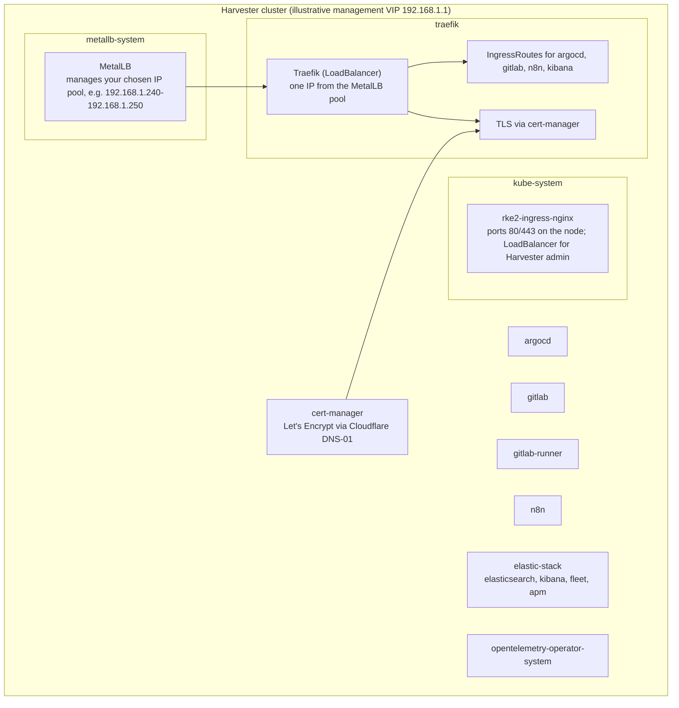

# Harvester cluster deployment guide

How to deploy the OpsContinuum chart on a Harvester cluster. Harvester differs
from Rancher Desktop and standard k3s clusters in ways that need extra
configuration.

## Harvester-specific considerations

Harvester clusters come with pre-installed components that affect this
deployment:

1. nginx-ingress: Harvester uses it for the management UI, bound to ports 80/443.
2. No LoadBalancer support: bare-metal Harvester has no cloud LoadBalancer by default.
3. RKE2 base: Harvester runs on RKE2, which ships its own set of Helm charts in `kube-system`.

### Components enabled for Harvester (not needed for Rancher Desktop)

| Component | Why Harvester needs it |
|-----------|------------------------|
| MetalLB | Provides LoadBalancer service support for bare-metal clusters |
| Traefik | A separate ingress controller, to avoid port conflicts with Harvester's nginx |

On Rancher Desktop or k3s with built-in Traefik, leave both disabled.

---

## Pre-deployment steps

### 1. Configure kubeconfig

After Harvester installation, download the kubeconfig from the Harvester UI and
configure it:

```bash
# Copy the downloaded kubeconfig
cp ~/Downloads/local.yaml ~/.kube/config

# Or merge with your existing config.
# Consider renaming the context to something recognisable, e.g.:
kubectl config rename-context local harvester

# Verify connectivity
kubectl get nodes
```

### 2. Install FluxCD

```bash
kubectl apply -f https://github.com/fluxcd/flux2/releases/latest/download/install.yaml

# Wait for controllers to be ready
kubectl -n flux-system rollout status deployment/helm-controller
kubectl -n flux-system rollout status deployment/source-controller
```

### 3. Install the required CRDs

The chart uses CRDs that must exist before the chart can deploy:

```bash
# ECK Operator CRDs (for Elasticsearch/Kibana)
kubectl create -f https://download.elastic.co/downloads/eck/3.2.0/crds.yaml

# Traefik CRDs (for IngressRoute resources)
kubectl apply -f https://raw.githubusercontent.com/traefik/traefik/v3.3/docs/content/reference/dynamic-configuration/kubernetes-crd-definition-v1.yml

# MetalLB CRDs (for IPAddressPool resources)
kubectl apply -f https://raw.githubusercontent.com/metallb/metallb/v0.14.9/config/crd/bases/metallb.io_ipaddresspools.yaml
kubectl apply -f https://raw.githubusercontent.com/metallb/metallb/v0.14.9/config/crd/bases/metallb.io_l2advertisements.yaml
```

### 4. Create the required secrets

```bash
# Create cert-manager namespace
kubectl create namespace cert-manager

# Create Cloudflare API token secret (for Let's Encrypt DNS-01 challenge)
kubectl create secret generic cloudflare-api-token \
  --namespace cert-manager \
  --from-literal=api-token=YOUR_CLOUDFLARE_API_TOKEN
```

---

## Chart configuration for Harvester

### values.yaml changes

Enable MetalLB and Traefik in your overlay's `helmrelease-patch.yaml`
(`overlays/harvester/helmrelease-patch.yaml`):

```yaml
# Enable Traefik with LoadBalancer mode (not hostNetwork to avoid port conflicts)
traefik:
  enabled: true
  hostNetwork:
    enabled: false
  service:
    enabled: true
    type: LoadBalancer

# Enable MetalLB for LoadBalancer support
metallb:
  enabled: true
  addressPool:
    name: default-pool
    # Use IPs that don't conflict with Harvester's own management VIP
    # Note: Harvester's ingress-expose service will claim one IP from this pool
    addresses: ["192.168.1.240-192.168.1.250"]  # Replace with your network's available IPs
```

Harvester's `ingress-expose` service (for the management UI) is a LoadBalancer
type and claims an IP from the MetalLB pool. Allocate at least 2 IPs so Traefik
can get one.

Also set `domain`, `certManager.acmeEmail`, and the
`gitlab.postgresqlPassword` / `gitlab.postgresqlPostgresPassword` /
`gitlab.redisPassword` values described in the top-level README before
deploying. The chart does not render without them.

---

## Deployment steps

### 1. Create the git authentication secret (for private repos)

```bash
kubectl create secret generic opsc-git-auth \
  --namespace flux-system \
  --from-literal=username=YOUR_GIT_USERNAME \
  --from-literal=password=YOUR_GIT_PAT
```

### 2. Create the GitRepository

```bash
kubectl apply -f - <<'EOF'
apiVersion: source.toolkit.fluxcd.io/v1
kind: GitRepository
metadata:
  name: opsc
  namespace: flux-system
spec:
  interval: 5m
  url: https://gitlab.example.test/YOUR_ORG/YOUR_REPO.git
  ref:
    branch: main
  secretRef:
    name: opsc-git-auth
EOF
```

### 3. Create the HelmRelease

```bash
kubectl apply -f - <<'EOF'
apiVersion: helm.toolkit.fluxcd.io/v2
kind: HelmRelease
metadata:
  name: opsc
  namespace: flux-system
spec:
  interval: 10m
  timeout: 15m
  chart:
    spec:
      chart: ./chart
      sourceRef:
        kind: GitRepository
        name: opsc
        namespace: flux-system
      reconcileStrategy: Revision
  install:
    remediation:
      retries: 3
  upgrade:
    remediation:
      retries: 3
      remediateLastFailure: true
    cleanupOnFail: true
EOF
```

### 4. Monitor the deployment

```bash
# Watch HelmReleases
kubectl get helmrelease -A -w

# Check all pods
kubectl get pods -A

# Force immediate reconciliation if needed
kubectl annotate gitrepository opsc -n flux-system \
  reconcile.fluxcd.io/requestedAt="$(date +%s)" --overwrite
```

---

## Post-deployment configuration

### Check service IPs

```bash
# Verify Traefik got a LoadBalancer IP
kubectl get svc -n traefik
# Example output:
# NAME              TYPE           CLUSTER-IP      EXTERNAL-IP    PORT(S)
# traefik-traefik   LoadBalancer   10.43.12.34     192.168.1.241  80:30772/TCP,443:31738/TCP

# Verify MetalLB IP pool
kubectl get ipaddresspool -n metallb-system
```

### Configure DNS or the hosts file

Point your domain names to Traefik's LoadBalancer IP (illustrative example:
`192.168.1.241`):

```
192.168.1.241 argocd.yourdomain.local
192.168.1.241 gitlab.yourdomain.local
192.168.1.241 n8n.yourdomain.local
192.168.1.241 kibana.yourdomain.local
```

Or configure proper DNS A records if you use a real domain with Let's
Encrypt.

---

## Troubleshooting

### Namespace stuck in Terminating

If namespaces get stuck during cleanup, check for resources with finalizers:

```bash
kubectl get ns <namespace> -o jsonpath='{.status.conditions}'

# Remove finalizers from blocking resources
kubectl get challenges.acme.cert-manager.io -n <namespace> -o name | \
  xargs -r kubectl patch -n <namespace> -p '{"metadata":{"finalizers":null}}' --type=merge
```

### MetalLB not assigning IPs

Check the controller logs:

```bash
kubectl logs -n metallb-system -l app.kubernetes.io/component=controller
```

Common causes:

- IP range exhausted (Harvester's `ingress-expose` claims one)
- IPAddressPool or L2Advertisement CRDs not installed

### Traefik service pending

If Traefik's LoadBalancer IP shows `<pending>`:

1. Check MetalLB is running: `kubectl get pods -n metallb-system`
2. Check the IPAddressPool exists: `kubectl get ipaddresspool -n metallb-system`
3. Check the L2Advertisement exists: `kubectl get l2advertisement -n metallb-system`

---

## Architecture summary



---

## Summary of Harvester-specific steps

1. Install FluxCD.
2. Install the ECK CRDs (for Elasticsearch).
3. Install the Traefik CRDs (for IngressRoute).
4. Install the MetalLB CRDs (for IPAddressPool).
5. Create the Cloudflare API token secret.
6. Enable MetalLB with an IP range (2+ IPs, since Harvester's `ingress-expose` claims one).
7. Enable Traefik in LoadBalancer mode (not hostNetwork).
8. Set `domain`, `certManager.acmeEmail`, and the GitLab PostgreSQL/Redis passwords (required, see README).
9. Create the FluxCD GitRepository and HelmRelease, both named `opsc`.
10. Configure DNS or the hosts file to point at Traefik's LoadBalancer IP.
